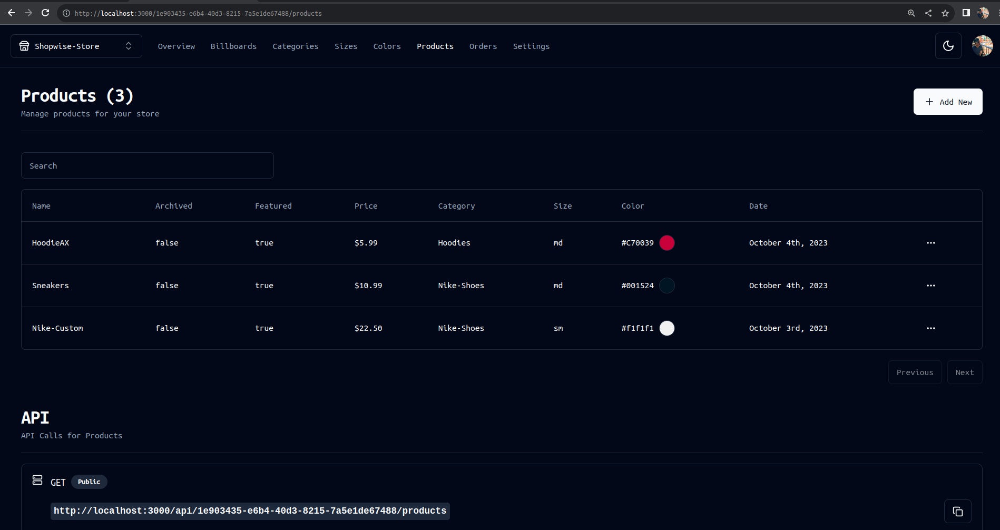

<!-- @format -->
# Full Stack 2023
# E-Commerce + Dashboard & CMS: Next.js 13 App Router, React, Tailwind, Prisma, Postgresql

### Admin DashBoard


### Create Products


### if want to see the "front-end Store " !
Goto Source Code : https://github.com/dhanubalde/Cms-Store-Nextjs.git


Key Features:

- We will be using Shadcn UI for the Admin!
- Our admin dashboard is going to serve as both CMS, Admin and API!
- You will be able to control mulitple vendors / stores through this single CMS! (For example you can have a "Shoe store" and a "Laptop store" and a "Suit store", and our CMS will generate API routes for all of those individually!)
- You will be able to create, update and delete categories!
- You will be able to create, update and delete products!
- You will be able to upload multiple images for products, and change them whenever you want!
- You will be able to create, update and delete filters such as "Color" and "Size", and then match them in the "Product" creation form.
- You will be able to create, update and delete "Billboards" which are these big texts on top of the page. You will be able to attach them to a single category, or use them standalone (Our Admin generates API for all of those cases!)
- You will be able to Search through all categories, products, sizes, colors, billboards with included pagination!
- You will be able to control which products are "featured" so they show on the homepage!
- You will be able to see your orders, sales, etc.
- You will be able to see graphs of your revenue etc.
- You will learn Clerk Authentication!
- Order creation
- Stripe checkout
- Stripe webhooks
- MySQL + Prisma + PlanetScale


This is a [Next.js](https://nextjs.org/) project bootstrapped with [`create-next-app`](https://github.com/vercel/next.js/tree/canary/packages/create-next-app).

## Getting Started

First, run the development server:

```bash
npm run dev
# or
yarn dev
# or
pnpm dev
# or
bun dev
```

Open [http://localhost:3000](http://localhost:3000) with your browser to see the result.

You can start editing the page by modifying `app/page.tsx`. The page auto-updates as you edit the file.

This project uses [`next/font`](https://nextjs.org/docs/basic-features/font-optimization) to automatically optimize and load Inter, a custom Google Font.

## Learn More

To learn more about Next.js, take a look at the following resources:

- [Next.js Documentation](https://nextjs.org/docs) - learn about Next.js features and API.
- [Learn Next.js](https://nextjs.org/learn) - an interactive Next.js tutorial.

You can check out [the Next.js GitHub repository](https://github.com/vercel/next.js/) - your feedback and contributions are welcome!

## Deploy on Vercel

The easiest way to deploy your Next.js app is to use the [Vercel Platform](https://vercel.com/new?utm_medium=default-template&filter=next.js&utm_source=create-next-app&utm_campaign=create-next-app-readme) from the creators of Next.js.

Check out our [Next.js deployment documentation](https://nextjs.org/docs/deployment) for more details.

# Next.js

# Install and configure Next.js.

# Create Project
### Start by creating a new Next.js project using create-next-app:
```
npx create-next-app@latest my-app --typescript --tailwind --eslint
```

### Create shadcn-ui init command to setup your project:
```
npx shadcn-ui@latest init
```


### Setup for Authentication ?
We use Clerk Authentication here's a link : https://clerk.com/?utm_source=search.yahoo.com&utm_medium=referral&utm_campaign=none
Create and  register your gmail account or manually

then read the following instruction for installation from the site:
```
npm install @clerk/nextjs
```
### Setup .env file


```js
NEXT_PUBLIC_CLERK_PUBLISHABLE_KEY=
CLERK_SECRET_KEY=
NEXT_PUBLIC_CLERK_SIGN_IN_URL=/sign-in
NEXT_PUBLIC_CLERK_SIGN_UP_URL=/sign-up
NEXT_PUBLIC_CLERK_AFTER_SIGN_IN_URL=/
NEXT_PUBLIC_CLERK_AFTER_SIGN_UP_URL=/

# This was inserted by `prisma init`:
# Environment variables declared in this file are automatically made available to Prisma.
# See the documentation for more detail: https://pris.ly/d/prisma-schema#accessing-environment-variables-from-the-schema

# Prisma supports the native connection string format for PostgreSQL, MySQL, SQLite, SQL Server, MongoDB and CockroachDB.
# See the documentation for all the connection string options: https://pris.ly/d/connection-strings

DATABASE_URL=''
NEXT_PUBLIC_CLOUDINARY_CLOUD_NAME=""
STRIPE_API_KEY=
FRONTEND_STORE_URL=http://localhost:3001
STRIPE_WEBHOOK_SECRET=
```

### Connect to Railway or PlanetScale and Push Prisma
```shell
npx prisma generate
npx prisma db push
```


### Start the app

```shell
npm run dev
```

