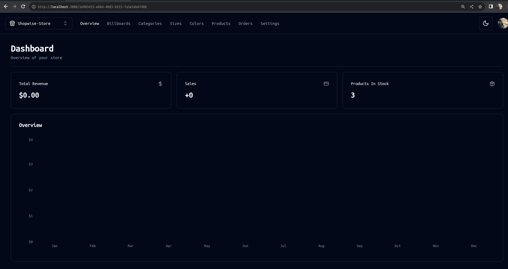

  <p align="center">A progressive <a href="http://nextjs.org" target="_blank">Next.js</a> framework for building efficient and scalable both server-side & client side applications.</p>
    <p align="center">
<a href="" target="_blank"></a>
<a href="" target="_blank"></a>
<a href="" target="_blank"></a>
<a href="" target="_blank"></a>
<a href="" target="_blank"></a>
<a href="" target="_blank"></a>
<a href="" target="_blank"></a>
<a href="" target="_blank"></a>
<a href="" target="_blank"></a>
<a href=""  target="_blank"></a>
</p>
  <!--[](https://opencollective.com/nest#backer)
  [](https://opencollective.com/nest#sponsor)-->


<!-- @format -->
# Full Stack 2023
codeslinger 

# E-Commerce + Dashboard & CMS: Next.js 13 App Router, React, Tailwind, Prisma, Postgresql
"""
This system aims to provide a comprehensive solution for managing and selling products through various vendors or stores. It includes features for product and category management, a user-friendly admin interface, and integrated payment processing with Stripe. The technology stack you've mentioned appears to support these functionalities.
"""
### Admin DashBoard


### Create Products


### if want to see the "front-end Store " !
Goto Source Code : https://github.com/dhanubalde/Cms-Store-Nextjs.git


Key Features:

#### Shadcn UI for the Admin: 
- You're planning to use Shadcn UI for the admin interface, which is likely a UI framework or library for creating the user interface.

#### Admin Dashboard as CMS, Admin, and API: 
- The admin dashboard will have multiple roles, serving as a content management system (CMS), an admin interface for managing the application, and also as an API for interacting with the application's data.

#### Control Multiple Vendors/Stores: 
- The system will support multiple vendors or stores. Each store might have its own unique content, such as products and categories.

##### Categories Management: 
- You can create, update, and delete categories. Categories help organize and classify products.

#### Products Management: 
- You can create, update, and delete products. Products are the items that vendors sell through your platform.

#### Multiple Product Images: 
- The system allows for uploading multiple images for products and changing them as needed. This feature enhances the product presentation.

#### Filters (e.g., Color and Size): 
- You can create, update, and delete filters like "Color" and "Size" and associate them with products. Filters help customers narrow down their product searches.

#### Billboards Management: 
- You can create, update, and delete billboards. Billboards are prominent text or promotional banners that can be attached to categories or used independently.

#### Search and Pagination: 
- Users can search through categories, products, sizes, colors, and billboards, with pagination for navigating search results efficiently.

#### Featured Products: 
- You can mark certain products as "featured" so that they are prominently displayed on the homepage or other relevant sections of the website.

#### Order and Sales Management: 
- The system allows you to track and manage orders and sales, providing valuable data and functionality for monitoring business operations.

#### Revenue Graphs: 
- Graphs and charts are available to visualize revenue and other performance metrics, helping you analyze the business's financial health.

#### Clerk Authentication: 
- Clerk is likely an authentication and authorization service, ensuring secure access to the admin dashboard and other parts of the system.

#### Order Creation: 
- This feature enables the creation of orders, likely for customers purchasing products from the vendors.

#### Stripe Checkout: 
- Integration with Stripe for processing payments, which is a common payment gateway solution.

#### Stripe Webhooks: 
- Stripe webhooks provide real-time notifications about events related to payments and transactions.

#### Database and ORM: 
- The technology stack includes MySQL as the database, Prisma as the Object-Relational Mapping (ORM) tool, and PlanetScale, which might be used for database scaling and management.


This is a [Next.js](https://nextjs.org/) project bootstrapped with [`create-next-app`](https://github.com/vercel/next.js/tree/canary/packages/create-next-app).

## Getting Started

First, run the development server:

```bash
npm run dev
# or
yarn dev
# or
pnpm dev
# or
bun dev
```

Open [http://localhost:3000](http://localhost:3000) with your browser to see the result.

You can start editing the page by modifying `app/page.tsx`. The page auto-updates as you edit the file.

This project uses [`next/font`](https://nextjs.org/docs/basic-features/font-optimization) to automatically optimize and load Inter, a custom Google Font.

## Learn More

To learn more about Next.js, take a look at the following resources:

- [Next.js Documentation](https://nextjs.org/docs) - learn about Next.js features and API.
- [Learn Next.js](https://nextjs.org/learn) - an interactive Next.js tutorial.

You can check out [the Next.js GitHub repository](https://github.com/vercel/next.js/) - your feedback and contributions are welcome!

## Deploy on Vercel

The easiest way to deploy your Next.js app is to use the [Vercel Platform](https://vercel.com/new?utm_medium=default-template&filter=next.js&utm_source=create-next-app&utm_campaign=create-next-app-readme) from the creators of Next.js.

Check out our [Next.js deployment documentation](https://nextjs.org/docs/deployment) for more details.

# Next.js

# Install and configure Next.js.

# Create Project
### Start by creating a new Next.js project using create-next-app:
```
npx create-next-app@latest my-app --typescript --tailwind --eslint
```

### Create shadcn-ui init command to setup your project:
```
npx shadcn-ui@latest init
```


### Setup for Authentication ?
We use Clerk Authentication here's a link : https://clerk.com/?utm_source=search.yahoo.com&utm_medium=referral&utm_campaign=none
Create and  register your gmail account or manually

then read the following instruction for installation from the site:
```
npm install @clerk/nextjs
```
### Setup .env file


```js
NEXT_PUBLIC_CLERK_PUBLISHABLE_KEY=
CLERK_SECRET_KEY=
NEXT_PUBLIC_CLERK_SIGN_IN_URL=/sign-in
NEXT_PUBLIC_CLERK_SIGN_UP_URL=/sign-up
NEXT_PUBLIC_CLERK_AFTER_SIGN_IN_URL=/
NEXT_PUBLIC_CLERK_AFTER_SIGN_UP_URL=/

# This was inserted by `prisma init`:
# Environment variables declared in this file are automatically made available to Prisma.
# See the documentation for more detail: https://pris.ly/d/prisma-schema#accessing-environment-variables-from-the-schema

# Prisma supports the native connection string format for PostgreSQL, MySQL, SQLite, SQL Server, MongoDB and CockroachDB.
# See the documentation for all the connection string options: https://pris.ly/d/connection-strings

DATABASE_URL=''
NEXT_PUBLIC_CLOUDINARY_CLOUD_NAME=""
STRIPE_API_KEY=
FRONTEND_STORE_URL=http://localhost:3001
STRIPE_WEBHOOK_SECRET=
```

### Connect to Railway or PlanetScale and Push Prisma
```shell
npx prisma generate
npx prisma db push
```


### Start the app

```shell
npm run dev
```

